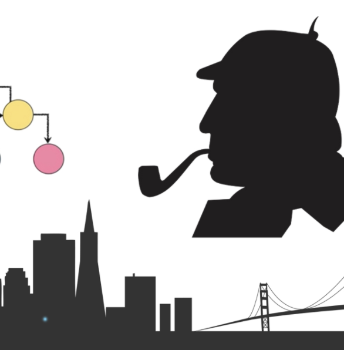
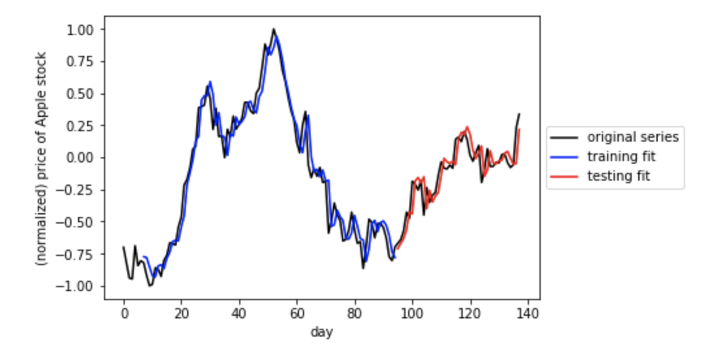

# Recurrent Neural Networks: time series prediction and text generation

## Overview

In this project, I built two RNNs that can generate sequences based on input data - with a focus on two applications: With the first, I used real market data in order to predict future Apple stock prices. The second one was trained on Sir Arthur Conan Doyle's classic novel Sherlock Holmes and generates wacky sentences based on this text.

## Perform time series prediction

I could not pass my raw data directly into my model, so I began by Cutting my time series data into sequences.  I did this by creating a windowing function which essentially runs a sliding window along the input series and constructs a set of associated input/output pairs to regress on.

## Build an RNN regression model.
Because of Keras' ease of use and abstraction layer, I was able to construct the RNN model with only a few lines of code.

- layer 1 uses an LSTM module with 5 hidden units (note here the input_shape = (window_size,1))
-  layer 2 uses a fully connected module with one unit
-  the 'mean_squared_error' loss was used because we are performing regression here

